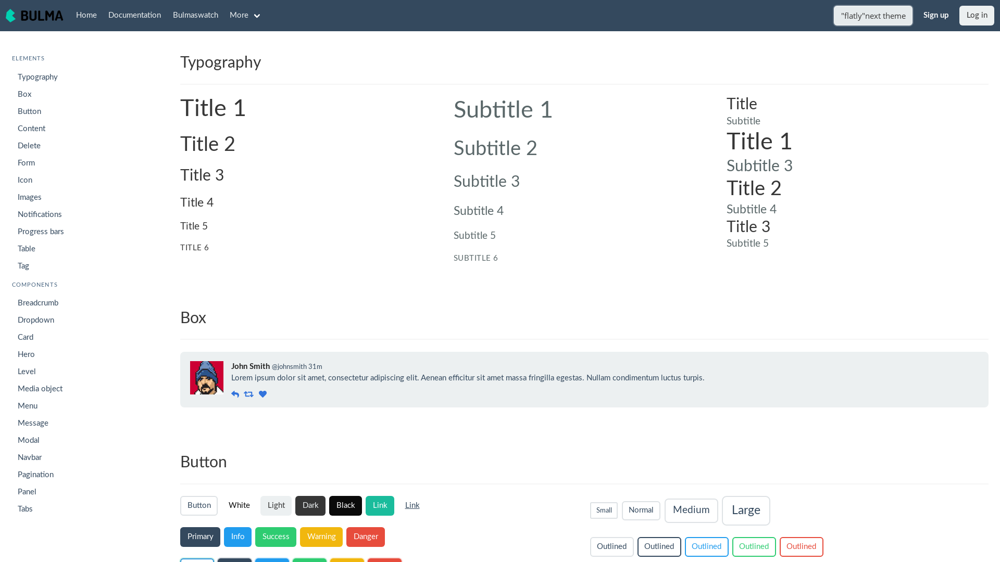
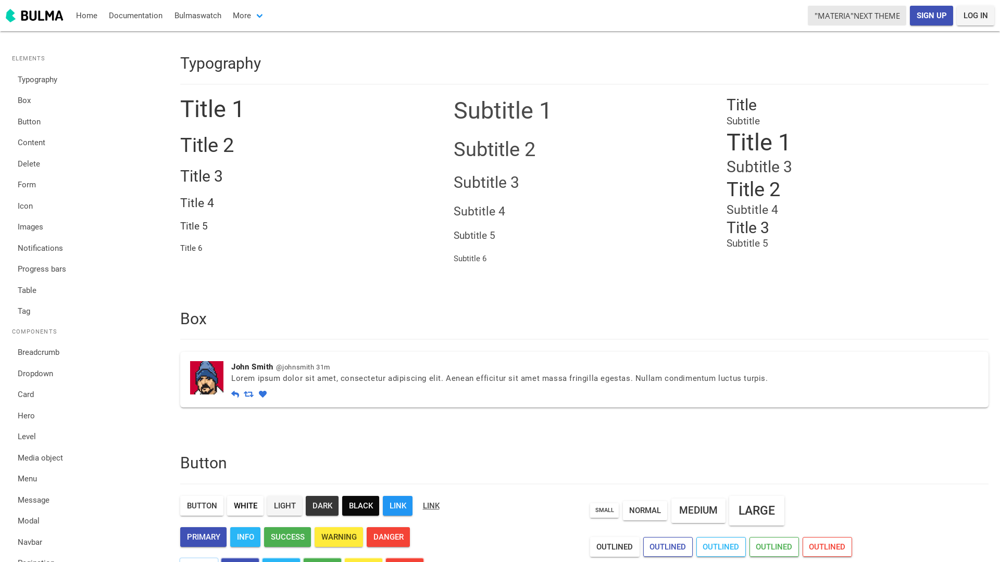
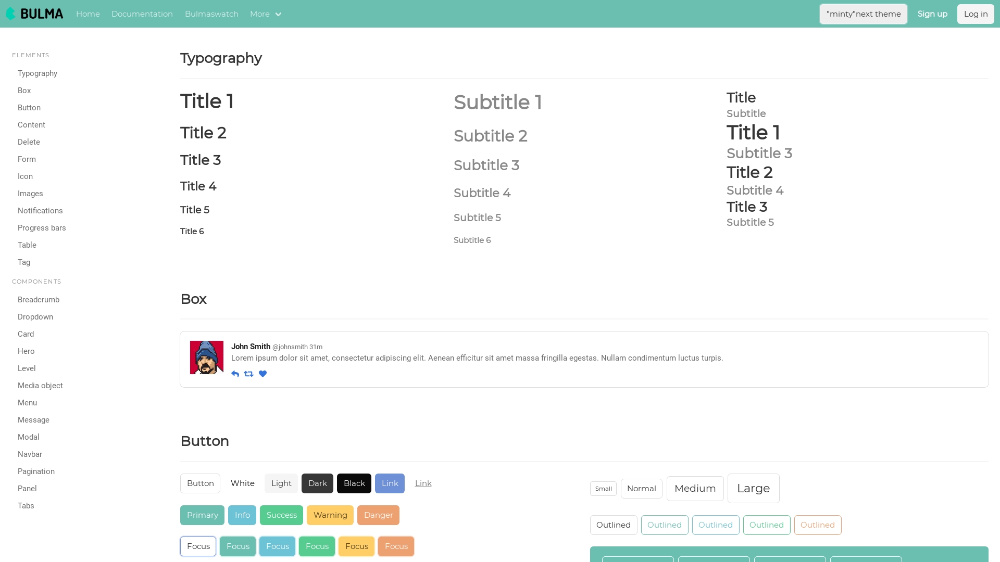

# README

### Purpose

This is a simple tryout to test if bulmaswatch themes working or not on gatsby

### Result

- Flatly


- Materia


- Minty


### Setup develop environment

#### To develop
```bash
$ yarn

$ yarn start

```

### To test
```bash
$ cd test

$ yarn

$ ./build.sh
```

### Credits
  - https://jenil.github.io/bulmaswatch/flatly/